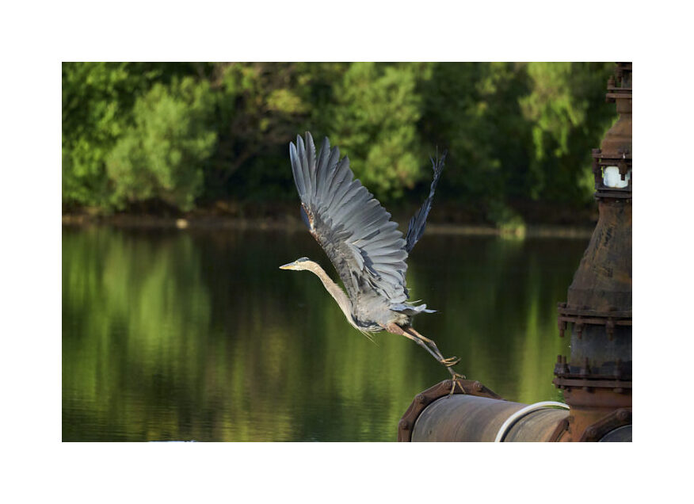
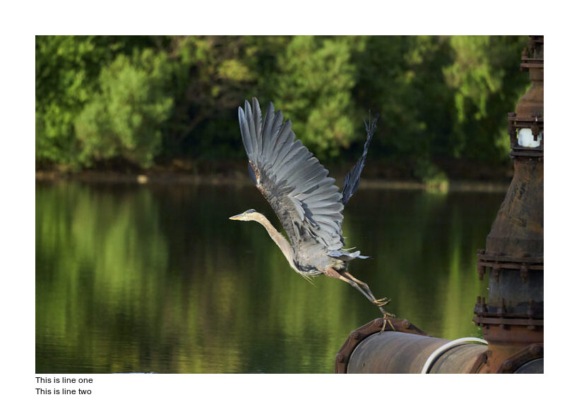
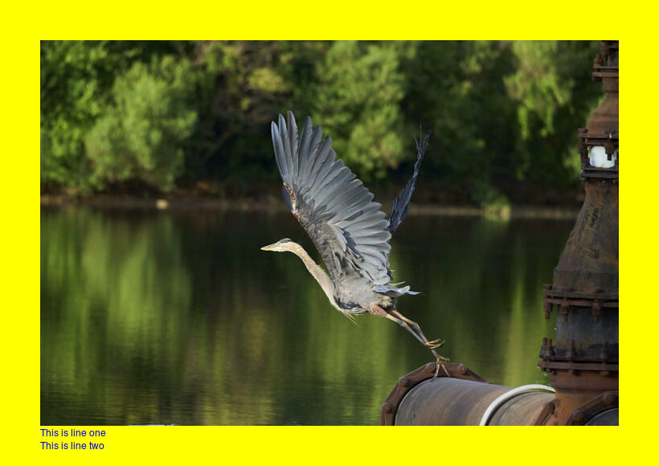
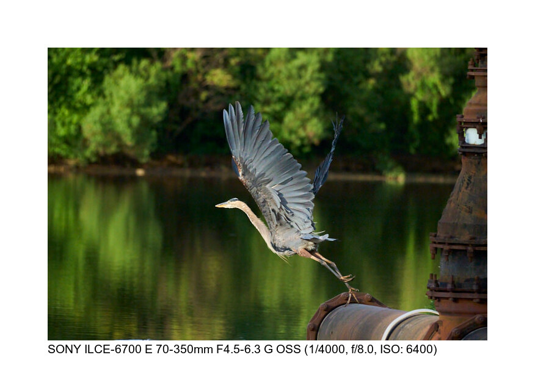

frame.py is a wrapper around ImageMagick to add borders and captions to image files. It supports fixed size, percentage, and golden ratio borders and allows customizing the colors of the border and font as well as the font face that is used. Caption sizing adjusts based on the border size. This is not meant to be a comprehensize tool - this is just wrapping the ImageMagick command line. The command line that is executed is printed so if you want to tweak something you can do that.

```text
usage: frame [-h] 
              -input INPUT  
              -output OUTPUT 
             [-method METHOD]
             [-caption CAPTION] 
             [-font FONT] 
             [-color COLOR]
             [-fontcolor FONTCOLOR]
```

|Command|Description|
|-------|-----------|
|-input|The input image file.|
|-output|The created file. If it exists it is overwriten.The path is created as needed.|
|-method|One of "golden", "nn%", "nn" - nn% defines the percentage of the longest edge to use as the frame width, "nn" is pixel width. "golden" applies the golden ratio.|
|-caption|A caption line to add to the lower left (aligned with the image). Can be used multiple times. The font size will scale as more lines are added.|
|-font|The font to use. Defaults: Arial|
|-color|The color of the border. Default: White|
|-fontcolor|The color of the caption font. Default: Black|

Captions can contain EXIF keys (surrounded by braces) which will be replaced with the EXIF value.  The keys are the [Base keys](https://pillow.readthedocs.io/en/stable/_modules/PIL/ExifTags.html#Base) from the Pillow library. See example 4 below.

Example:

```sh
python frame.py -input doc/launch.jpg -output output/framed1.jpg
```



```sh
python frame.py -input doc/launch.jpg -output output/framed2.jpg -method 7% -caption "This is line one" -caption "This is line two"
```




```sh
python frame.py -input doc/launch.jpg -output output/framed3.jpg -font Helvetica -fontcolor Blue -color Yellow -method 7% -caption "This is line one" -caption "This is line two"
```


```sh
python frame.py -input doc/launch.jpg -output output/framed4.jpg -caption "{Make} {Model} {LensModel} (1/{ExposureTime}, f/{FNumber}, ISO: {ISOSpeedRatings})" 
```



